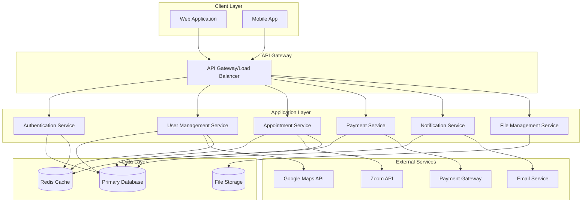
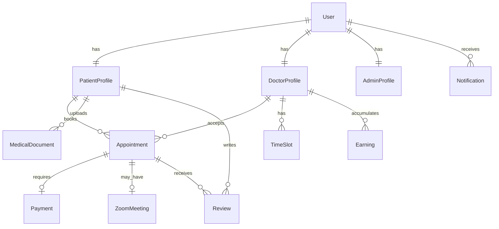

# Design Document

## Overview

PatientCare is a multi-tenant healthcare appointment booking platform built with a modern web architecture supporting role-based access for patients, doctors, and administrators. The system integrates with external services including Zoom for video consultations, Google Maps for location services, and payment gateways for secure transactions.

The platform follows a microservices-inspired modular architecture with clear separation of concerns, ensuring scalability, maintainability, and security for healthcare data management.

## Architecture

### System Architecture



### Technology Stack

**Frontend:**
- React.js with TypeScript for web application
- React Native for mobile applications
- Material-UI or Tailwind CSS for responsive design
- Redux Toolkit for state management

**Backend:**
- Node.js with Express.js framework
- TypeScript for type safety
- JWT for authentication
- Prisma ORM for database operations

**Database:**
- PostgreSQL for primary data storage
- Redis for caching and session management

**External Integrations:**
- Zoom SDK for video consultations
- Google Maps JavaScript API
- Stripe/Razorpay for payment processing
- SendGrid/AWS SES for email notifications

**Infrastructure:**
- Docker containers for deployment
- AWS/Azure cloud hosting
- CloudFront/CDN for static assets
- S3/Blob Storage for file uploads

## Components and Interfaces

### Core Components

#### 1. Authentication & Authorization Module

**Responsibilities:**
- User registration and login
- JWT token management
- Role-based access control
- Password security and recovery

**Key Interfaces:**
```typescript
interface AuthService {
  register(userData: UserRegistrationData): Promise<AuthResult>
  login(credentials: LoginCredentials): Promise<AuthResult>
  verifyToken(token: string): Promise<UserSession>
  refreshToken(refreshToken: string): Promise<AuthResult>
  logout(userId: string): Promise<void>
}

interface UserRegistrationData {
  email: string
  password: string
  role: 'patient' | 'doctor' | 'admin'
  profileData: PatientProfile | DoctorProfile
}
```

#### 2. User Management Module

**Responsibilities:**
- Profile management for all user types
- Doctor verification workflow
- User search and filtering

**Key Interfaces:**
```typescript
interface UserService {
  createProfile(userId: string, profileData: UserProfile): Promise<User>
  updateProfile(userId: string, updates: Partial<UserProfile>): Promise<User>
  verifyDoctor(doctorId: string, verificationData: DoctorVerification): Promise<void>
  searchDoctors(criteria: SearchCriteria): Promise<Doctor[]>
  getNearbyProviders(location: GeoLocation, radius: number): Promise<Provider[]>
}

interface DoctorProfile {
  name: string
  profilePicture?: string
  medicalLicenseNumber: string
  qualifications: string[]
  yearsOfExperience: number
  specialization: string[]
  contactInfo: ContactInfo
  clinicInfo: ClinicInfo
}
```

#### 3. Appointment Management Module

**Responsibilities:**
- Appointment scheduling and lifecycle management
- Status transitions and business rules
- Calendar integration

**Key Interfaces:**
```typescript
interface AppointmentService {
  createAppointment(appointmentData: AppointmentRequest): Promise<Appointment>
  updateAppointmentStatus(appointmentId: string, status: AppointmentStatus): Promise<Appointment>
  getAppointments(userId: string, filters?: AppointmentFilters): Promise<Appointment[]>
  cancelAppointment(appointmentId: string, reason: string): Promise<void>
  rescheduleAppointment(appointmentId: string, newDateTime: Date): Promise<Appointment>
}

interface Appointment {
  id: string
  patientId: string
  doctorId: string
  scheduledDateTime: Date
  type: 'online' | 'physical'
  status: AppointmentStatus
  paymentStatus: PaymentStatus
  zoomMeetingId?: string
  notes?: string
  createdAt: Date
  updatedAt: Date
}

type AppointmentStatus = 
  | 'awaiting_acceptance' 
  | 'rejected' 
  | 'payment_pending' 
  | 'confirmed' 
  | 'completed' 
  | 'cancelled'
```

#### 4. Payment Processing Module

**Responsibilities:**
- Secure payment processing
- Payment status tracking
- Doctor earnings management

**Key Interfaces:**
```typescript
interface PaymentService {
  createPaymentIntent(appointmentId: string, amount: number): Promise<PaymentIntent>
  processPayment(paymentData: PaymentData): Promise<PaymentResult>
  refundPayment(paymentId: string, reason: string): Promise<RefundResult>
  getDoctorEarnings(doctorId: string, period: DateRange): Promise<EarningsReport>
  getPaymentHistory(userId: string): Promise<Payment[]>
}

interface PaymentData {
  appointmentId: string
  amount: number
  currency: string
  paymentMethodId: string
  customerId: string
}
```

#### 5. Video Consultation Module

**Responsibilities:**
- Zoom meeting creation and management
- Meeting link distribution
- Consultation session tracking

**Key Interfaces:**
```typescript
interface VideoConsultationService {
  createMeeting(appointmentId: string): Promise<ZoomMeeting>
  getMeetingDetails(meetingId: string): Promise<ZoomMeeting>
  endMeeting(meetingId: string): Promise<void>
  generateMeetingLink(meetingId: string, userRole: 'host' | 'participant'): Promise<string>
}

interface ZoomMeeting {
  id: string
  meetingId: string
  hostUrl: string
  joinUrl: string
  password: string
  startTime: Date
  duration: number
  status: 'scheduled' | 'started' | 'ended'
}
```

#### 6. Notification System

**Responsibilities:**
- Multi-channel notification delivery
- Notification templates and scheduling
- User notification preferences

**Key Interfaces:**
```typescript
interface NotificationService {
  sendNotification(notification: NotificationData): Promise<void>
  scheduleNotification(notification: NotificationData, scheduledTime: Date): Promise<string>
  cancelScheduledNotification(notificationId: string): Promise<void>
  getUserNotifications(userId: string): Promise<Notification[]>
  updateNotificationPreferences(userId: string, preferences: NotificationPreferences): Promise<void>
}

interface NotificationData {
  userId: string
  type: NotificationType
  title: string
  message: string
  channels: NotificationChannel[]
  data?: Record<string, any>
}

type NotificationType = 
  | 'appointment_booked' 
  | 'appointment_accepted' 
  | 'appointment_rejected'
  | 'payment_confirmed' 
  | 'appointment_reminder' 
  | 'meeting_link_ready'

type NotificationChannel = 'in_app' | 'email' | 'push'
```

## Data Models

### Core Entities

#### User Entity
```typescript
interface User {
  id: string
  email: string
  passwordHash: string
  role: UserRole
  isVerified: boolean
  isActive: boolean
  createdAt: Date
  updatedAt: Date
  profile: PatientProfile | DoctorProfile | AdminProfile
}

type UserRole = 'patient' | 'doctor' | 'admin'
```

#### Patient Profile
```typescript
interface PatientProfile {
  userId: string
  name: string
  age: number
  gender: 'male' | 'female' | 'other'
  contactInfo: ContactInfo
  address: Address
  medicalHistory: MedicalDocument[]
  emergencyContact?: ContactInfo
}
```

#### Doctor Profile
```typescript
interface DoctorProfile {
  userId: string
  name: string
  profilePicture?: string
  medicalLicenseNumber: string
  licenseVerificationStatus: 'pending' | 'verified' | 'rejected'
  qualifications: string[]
  yearsOfExperience: number
  specializations: string[]
  contactInfo: ContactInfo
  clinicInfo: ClinicInfo
  consultationFee: number
  availableSlots: TimeSlot[]
  rating: number
  totalReviews: number
  isAcceptingPatients: boolean
}
```

#### Appointment Entity
```typescript
interface Appointment {
  id: string
  patientId: string
  doctorId: string
  scheduledDateTime: Date
  type: 'online' | 'physical'
  status: AppointmentStatus
  paymentId?: string
  paymentStatus: PaymentStatus
  zoomMeetingId?: string
  consultationNotes?: string
  prescriptions?: Prescription[]
  followUpRequired: boolean
  createdAt: Date
  updatedAt: Date
}
```

#### Payment Entity
```typescript
interface Payment {
  id: string
  appointmentId: string
  patientId: string
  doctorId: string
  amount: number
  currency: string
  status: PaymentStatus
  paymentMethodId: string
  transactionId: string
  processedAt?: Date
  refundedAt?: Date
  refundReason?: string
}

type PaymentStatus = 'pending' | 'completed' | 'failed' | 'refunded'
```

#### Medical Document Entity
```typescript
interface MedicalDocument {
  id: string
  patientId: string
  fileName: string
  fileType: 'image' | 'pdf'
  fileUrl: string
  uploadedAt: Date
  description?: string
  documentType: 'lab_report' | 'prescription' | 'scan' | 'other'
}
```

### Database Schema Relationships



## Error Handling

### Error Categories

1. **Validation Errors (400)**
   - Invalid input data
   - Missing required fields
   - Business rule violations

2. **Authentication Errors (401)**
   - Invalid credentials
   - Expired tokens
   - Insufficient permissions

3. **Authorization Errors (403)**
   - Role-based access violations
   - Resource ownership violations

4. **Not Found Errors (404)**
   - Non-existent resources
   - Deleted entities

5. **Business Logic Errors (422)**
   - Appointment booking conflicts
   - Payment processing failures
   - External service integration errors

6. **Server Errors (500)**
   - Database connection failures
   - External API timeouts
   - Unexpected system errors

### Error Response Format

```typescript
interface ErrorResponse {
  error: {
    code: string
    message: string
    details?: Record<string, any>
    timestamp: string
    requestId: string
  }
}
```

### Error Handling Strategy

1. **Input Validation**: Use schema validation (Joi/Yup) at API boundaries
2. **Business Logic Validation**: Implement custom validators for complex business rules
3. **External Service Failures**: Implement circuit breaker pattern with fallback mechanisms
4. **Database Errors**: Use connection pooling and retry logic with exponential backoff
5. **Logging**: Structured logging with correlation IDs for request tracing

## Testing Strategy

### Testing Pyramid

#### Unit Tests (70%)
- Service layer business logic
- Utility functions and helpers
- Data validation and transformation
- Mock external dependencies

#### Integration Tests (20%)
- API endpoint testing
- Database operations
- External service integrations
- Authentication and authorization flows

#### End-to-End Tests (10%)
- Critical user journeys
- Payment processing workflows
- Appointment booking flows
- Cross-browser compatibility

### Testing Tools and Frameworks

**Backend Testing:**
- Jest for unit and integration tests
- Supertest for API testing
- Test containers for database testing
- MSW (Mock Service Worker) for external API mocking

**Frontend Testing:**
- React Testing Library for component tests
- Jest for unit tests
- Cypress for end-to-end tests
- Storybook for component documentation and testing

### Test Data Management

1. **Test Database**: Separate test database with seed data
2. **Factory Pattern**: Use factories for creating test data
3. **Cleanup Strategy**: Automatic cleanup after each test suite
4. **Mock External Services**: Mock Zoom, payment gateways, and email services

### Performance Testing

1. **Load Testing**: Simulate concurrent user scenarios
2. **Stress Testing**: Test system limits and failure points
3. **Database Performance**: Query optimization and indexing validation
4. **API Response Times**: Ensure sub-200ms response times for critical endpoints

### Security Testing

1. **Authentication Testing**: Verify JWT implementation and session management
2. **Authorization Testing**: Validate role-based access controls
3. **Input Validation**: Test for SQL injection and XSS vulnerabilities
4. **Data Encryption**: Verify encryption of sensitive healthcare data
5. **HIPAA Compliance**: Ensure healthcare data protection standards