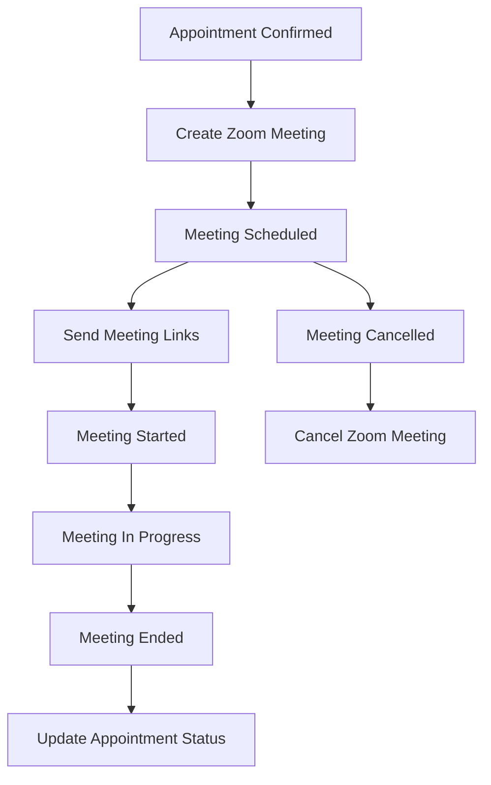

# Zoom Integration Documentation

## Overview

The PatientCare platform integrates with Zoom to provide seamless video consultation capabilities for online appointments. This integration automatically creates Zoom meetings when appointments are confirmed and manages the entire meeting lifecycle.

## Features

- **Automatic Meeting Creation**: Zoom meetings are automatically created when online appointments are confirmed
- **Meeting Link Distribution**: Both doctors and patients receive appropriate meeting links (host/participant)
- **Meeting Status Tracking**: Real-time tracking of meeting status (scheduled, started, ended, cancelled)
- **Webhook Support**: Handles Zoom webhooks for meeting events
- **Meeting Cleanup**: Automated cleanup of old meeting records
- **Security**: Secure password-protected meetings with waiting rooms

## Setup

### 1. Zoom App Configuration

1. Create a Server-to-Server OAuth app in the Zoom Marketplace
2. Configure the following scopes:
   - `meeting:write:admin`
   - `meeting:read:admin`
   - `user:read:admin`
3. Note down your App credentials:
   - Account ID
   - Client ID (API Key)
   - Client Secret (API Secret)

### 2. Environment Variables

Add the following environment variables to your `.env` file:

```env
ZOOM_API_KEY=your-zoom-client-id
ZOOM_API_SECRET=your-zoom-client-secret
ZOOM_ACCOUNT_ID=your-zoom-account-id
ZOOM_WEBHOOK_SECRET=your-webhook-secret-token
```

### 3. Database Migration

The Zoom integration requires a new database table. Run the Prisma migration:

```bash
npx prisma db push
```

## API Endpoints

### Meeting Management

#### Create Meeting
```http
POST /api/zoom/meetings
Authorization: Bearer <token>
Content-Type: application/json

{
  "appointmentId": "uuid",
  "topic": "Medical Consultation",
  "startTime": "2024-01-15T10:00:00Z",
  "duration": 30,
  "hostEmail": "doctor@example.com",
  "participantEmail": "patient@example.com",
  "participantName": "John Doe"
}
```

#### Get Meeting by Appointment ID
```http
GET /api/zoom/meetings/appointment/{appointmentId}
Authorization: Bearer <token>
```

#### Get Meeting Details
```http
GET /api/zoom/meetings/{meetingId}
Authorization: Bearer <token>
```

#### Get Meeting Link
```http
GET /api/zoom/meetings/{meetingId}/link?role=host|participant
Authorization: Bearer <token>
```

#### Update Meeting
```http
PUT /api/zoom/meetings/{meetingId}
Authorization: Bearer <token>
Content-Type: application/json

{
  "topic": "Updated Topic",
  "startTime": "2024-01-15T11:00:00Z",
  "duration": 45
}
```

#### Cancel Meeting
```http
DELETE /api/zoom/meetings/{meetingId}
Authorization: Bearer <token>
```

#### Start Meeting
```http
POST /api/zoom/meetings/{meetingId}/start
Authorization: Bearer <token>
```

#### End Meeting
```http
POST /api/zoom/meetings/{meetingId}/end
Authorization: Bearer <token>
```

### Statistics

#### Get Meeting Statistics
```http
GET /api/zoom/stats
Authorization: Bearer <token>
```

### Webhooks

#### Zoom Webhook Endpoint
```http
POST /api/zoom/webhook
Content-Type: application/json

{
  "event": "meeting.started",
  "payload": {
    "account_id": "account_id",
    "object": {
      "id": "meeting_id",
      "uuid": "meeting_uuid",
      "host_id": "host_id",
      "topic": "Meeting Topic",
      "type": 2,
      "start_time": "2024-01-15T10:00:00Z",
      "duration": 30,
      "timezone": "UTC",
      "created_at": "2024-01-15T09:00:00Z",
      "join_url": "https://zoom.us/j/123456789",
      "password": "password123"
    }
  }
}
```

## Integration Flow

### 1. Appointment Booking Flow

1. Patient books an online appointment
2. Doctor accepts the appointment
3. Patient completes payment
4. **Appointment status changes to "CONFIRMED"**
5. **Zoom meeting is automatically created**
6. Both doctor and patient receive meeting details

### 2. Meeting Access Flow

1. Doctor accesses meeting via host URL (can start meeting)
2. Patient accesses meeting via join URL (joins as participant)
3. Meeting status is tracked in real-time via webhooks

### 3. Meeting Lifecycle



## Service Architecture

### ZoomService

The main service class that handles all Zoom API interactions:

- **Authentication**: Manages OAuth tokens and API authentication
- **Meeting CRUD**: Create, read, update, delete meetings
- **Status Management**: Track and update meeting status
- **Webhook Handling**: Process Zoom webhook events
- **Cleanup**: Archive old meeting records

### ZoomController

REST API controller that exposes Zoom functionality:

- **Request Validation**: Validates incoming requests
- **Authorization**: Ensures proper user permissions
- **Error Handling**: Provides consistent error responses
- **Response Formatting**: Standardizes API responses

### Database Schema

```sql
-- Zoom meetings table
CREATE TABLE zoom_meetings (
    id UUID PRIMARY KEY DEFAULT gen_random_uuid(),
    appointment_id UUID UNIQUE NOT NULL REFERENCES appointments(id),
    zoom_meeting_id VARCHAR UNIQUE NOT NULL,
    topic VARCHAR NOT NULL,
    start_time TIMESTAMP NOT NULL,
    duration INTEGER NOT NULL,
    host_url TEXT NOT NULL,
    join_url TEXT NOT NULL,
    password VARCHAR NOT NULL,
    status VARCHAR DEFAULT 'scheduled',
    host_email VARCHAR NOT NULL,
    created_at TIMESTAMP DEFAULT NOW(),
    updated_at TIMESTAMP DEFAULT NOW()
);
```

## Security Considerations

### 1. Meeting Security

- **Password Protection**: All meetings are password-protected
- **Waiting Room**: Enabled by default to control access
- **Host Control**: Only doctors can start meetings
- **Time-Limited Access**: Meeting links expire after the scheduled time

### 2. API Security

- **Authentication**: All endpoints require valid JWT tokens
- **Authorization**: Role-based access control (RBAC)
- **Rate Limiting**: API rate limiting to prevent abuse
- **Input Validation**: Comprehensive request validation

### 3. Data Protection

- **Encryption**: Sensitive data encrypted at rest and in transit
- **Access Logs**: Meeting access is logged for audit purposes
- **Data Retention**: Old meeting records are automatically archived

## Error Handling

### Common Error Scenarios

1. **Zoom API Unavailable**: Graceful degradation, appointment continues without meeting
2. **Invalid Credentials**: Clear error messages for configuration issues
3. **Meeting Conflicts**: Automatic conflict detection and resolution
4. **Network Issues**: Retry logic with exponential backoff

### Error Response Format

```json
{
  "error": {
    "code": "ZOOM_API_ERROR",
    "message": "Failed to create Zoom meeting",
    "details": {
      "zoomError": "Invalid meeting time",
      "appointmentId": "uuid"
    },
    "timestamp": "2024-01-15T10:00:00Z"
  }
}
```

## Monitoring and Logging

### Key Metrics

- Meeting creation success rate
- Meeting attendance rates
- API response times
- Error rates by type

### Log Events

- Meeting creation/deletion
- Status changes
- Webhook events
- API errors
- Authentication failures

## Maintenance

### Regular Tasks

1. **Token Refresh**: OAuth tokens are automatically refreshed
2. **Meeting Cleanup**: Run cleanup script weekly
3. **Log Rotation**: Rotate logs to prevent disk space issues
4. **Health Checks**: Monitor Zoom API connectivity

### Cleanup Script

Run the cleanup script periodically:

```bash
# Manual cleanup
npm run cleanup:zoom

# Or via cron job (weekly)
0 2 * * 0 cd /path/to/app && npm run cleanup:zoom
```

## Troubleshooting

### Common Issues

1. **Meeting Creation Fails**
   - Check Zoom API credentials
   - Verify account permissions
   - Check API rate limits

2. **Webhooks Not Working**
   - Verify webhook URL configuration
   - Check webhook secret token
   - Ensure endpoint is publicly accessible

3. **Meeting Links Invalid**
   - Check meeting status
   - Verify meeting hasn't expired
   - Confirm user permissions

### Debug Mode

Enable debug logging:

```env
LOG_LEVEL=debug
```

## Testing

### Unit Tests

```bash
npm run test -- --testPathPattern=zoomService
```

### Integration Tests

```bash
npm run test:integration -- zoom
```

### Manual Testing

1. Create a test appointment
2. Confirm the appointment
3. Verify Zoom meeting creation
4. Test meeting links
5. Verify webhook handling

## Future Enhancements

1. **Recording Support**: Automatic meeting recording
2. **Breakout Rooms**: Support for multiple participants
3. **Meeting Analytics**: Detailed meeting analytics
4. **Custom Branding**: Branded meeting experience
5. **Mobile SDK**: Native mobile app integration

## Support

For issues related to Zoom integration:

1. Check the logs for error details
2. Verify Zoom API status
3. Review configuration settings
4. Contact support with relevant log entries